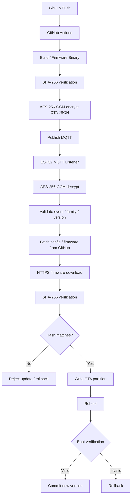
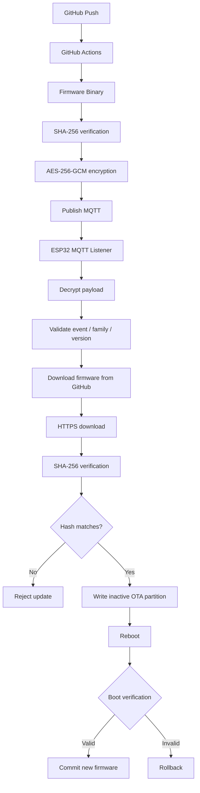

# ESP32-OTA — MQTT-Triggered Over-The-Air Firmware Update System

A secure **MQTT-triggered OTA firmware update system for ESP32**, using GitHub as the firmware distribution backend and HiveMQ as the MQTT notification broker.

|                         |                                                              |
| ----------------------- | ------------------------------------------------------------ |
| **Version**             | **v1.0**                                                     |
| **Language**            | **[🇩🇪 DEUTSCH](#deutsch)** · **[🇬🇧 ENGLISH](#english)**   |
| **Platform**            | ESP32 · ESP-IDF v6.0.0+                                      |
| **Firmware Distribution** | GitHub Raw Content                                       |
| **OTA Trigger**         | MQTT · HiveMQ                                                |
| **Payload Security**    | AES-256-GCM                                                  |
| **Firmware Integrity**  | SHA-256 via PSA Crypto                                       |
| **Transport**           | MQTTS/TLS 8883 · TCP 1883 fallback                           |
| **OTA Architecture**    | Dual OTA partitions + automatic rollback                     |
| **Flash Requirement**   | 4 MB                                                         |

> **⚠️ Important:** Always make sure to **clear the flash memory before you flash the factory firmware**.

---

# DEUTSCH

> **English version:** [🇬🇧 Zum englischen Abschnitt / Go to English](#english)

## 1. Was ist dieses ESP32-OTA-System?

Dieses Projekt implementiert ein MQTT-gesteuertes **Over-The-Air-Firmware-Update-System für ESP32**.

GitHub dient als Firmware-Distribution-Backend, während HiveMQ die OTA-Benachrichtigung an die ESP32-Geräte über MQTT überträgt.

Der grundsätzliche Ablauf:

```text
Developer
    │
    │ Push to main
    ▼
GitHub Actions
    │
    ├── SHA-256 verification
    ├── AES-256-GCM encryption
    └── MQTT publish
    ▼
HiveMQ
    │
    │ Encrypted OTA trigger
    ▼
ESP32
    │
    ├── Decrypt MQTT payload
    ├── Validate event / family / version
    ├── Download firmware from GitHub
    ├── Verify SHA-256
    └── Reboot into new OTA partition
```

### Warum MQTT + GitHub?

Das System trennt OTA-Benachrichtigung und Firmware-Verteilung:

* **MQTT** wird nur verwendet, um dem Gerät mitzuteilen, dass ein Update verfügbar ist.
* **GitHub** stellt `config.json` und die eigentliche Firmware-Binärdatei bereit.
* Die Firmware wird nach dem Download erneut per **SHA-256** überprüft.
* Der MQTT-Trigger selbst ist mit **AES-256-GCM** geschützt.

### Sicherheits- und Zuverlässigkeitsmodell

```text
MQTT Trigger
     │
     ▼
AES-256-GCM
     │
     ▼
Event / Family / Version validation
     │
     ▼
HTTPS Firmware download
     │
     ▼
SHA-256 verification
     │
     ▼
OTA partition
     │
     ▼
Boot verification
     │
 ┌───┴────┐
 ▼        ▼
VALID    INVALID
 │        │
Commit   Rollback
```

---

## 2. Projekt einrichten

## 2.1 Fork, Clone und konfigurieren

Forke das Repository auf GitHub und klone anschließend deine eigene Kopie:

```bash
git clone https://github.com/YOUR_USERNAME/ESP-32-OTA-Firmware-Update.git

cd ESP-32-OTA-Firmware-Update
```

Entferne die vorhandene `code.bin` und passe `config.json` zunächst an die Firmware-Version in `factory_config.h` an.

Beispiel:

```json
{
  "version": "1.0.0",
  "firmware_bin": "code.bin",
  "mqtt_broker": "broker.hivemq.com",
  "mqtt_port_tls": 8883,
  "mqtt_port_tcp": 1883,
  "mqtt_topic": "/esp32-ota/trigger/YOUR_USERNAME",
  "device_family": ["esp32-gen1", "all"]
}
```

> Wenn die Version in `config.json` bereits größer oder unterschiedlich zur Factory-Version ist, kann das Gerät nach dem ersten Boot direkt einen OTA-Versuch starten.

Für private Repositories muss `FACTORY_GITHUB_TOKEN` in `factory_config.h` gesetzt werden, damit der ESP32 sich gegenüber GitHub authentifizieren kann.

---

## 2.2 Factory Credentials konfigurieren

Bearbeite:

```text
main/firmware/factory_config.h
```

und trage die Factory-Konfiguration ein:

```c
#define FACTORY_DEVICE_ID          "ESP32_DEVICE_001"
#define FACTORY_DEVICE_FAMILY      "esp32-gen1"
#define FACTORY_FIRMWARE_VERSION   "1.0.0"

#define FACTORY_WIFI_SSID          "YOUR_SSID"
#define FACTORY_WIFI_PASSWORD      "YOUR_PASSWORD"

#define FACTORY_GITHUB_REPO        "USER/REPO"
#define FACTORY_GITHUB_TOKEN       ""

#define FACTORY_MQTT_HOST          "broker.hivemq.com"
#define FACTORY_MQTT_PORT          8883
#define FACTORY_MQTT_TOPIC         "/esp32-ota/trigger/USER"

#define FACTORY_MQTT_USERNAME      ""
#define FACTORY_MQTT_PASSWORD      ""

static const uint8_t FACTORY_AES_KEY[32] = { ... };
```

Diese Werte werden beim ersten Factory-Boot als Default-Konfiguration in den NVS geschrieben.

---

## 2.3 AES-256-Key erzeugen

Erzeuge einen zufälligen 256-Bit-Key:

```bash
python3 -c "import secrets; print(secrets.token_hex(32))"
```

Der erzeugte Hex-Key wird anschließend in ein C-Byte-Array konvertiert:

```bash
python3 -c "
key = bytes.fromhex('YOUR_HEX_KEY_HERE')

print('static const uint8_t FACTORY_AES_KEY[32] = {')

for i in range(0, 32, 8):
    chunk = ', '.join(f'0x{b:02X}' for b in key[i:i+8])
    comma = ',' if i + 8 < 32 else ''
    print(f'    {chunk}{comma}')

print('};')
"
```

Der gleiche Hex-Key muss als GitHub Repository Secret hinterlegt werden:

```text
Settings
  → Secrets and variables
  → Actions
  → New repository secret
```

Secret name:

```text
FIRMWARE_AES_KEY
```

> Bei einem öffentlichen Repository ist der AES-Key in `factory_config.h` sichtbar. Für Production-Geräte sollte der Schlüssel während der Fertigung provisioniert werden.

---

## 2.4 User Application Code

Die eigentliche Benutzeranwendung befindet sich in:

```text
main/user_space/user_space.c
```

Dort kann die gewünschte ESP32-Anwendungslogik implementiert werden.

Die Factory-Firmware verwendet:

```text
FACTORY_FIRMWARE_VERSION
```

als initiale Firmware-Version.

Der Hook:

```c
user_space_nvs_update_hook()
```

wird beim Boot ausgeführt und kann für NVS-Migrationen der User-Anwendung verwendet werden.

---

## 2.5 Factory Firmware flashen

Empfohlene Factory-Version:

```text
1.0.0
```

Kein `v`-Prefix verwenden:

```text
1.0.0
```

nicht:

```text
v1.0.0
```

### ⚠️ Flash-Speicher vorher löschen

**Always clear the flash memory before flashing the factory firmware.**

Verwende:

```bash
idf.py set-target esp32
idf.py build
idf.py erase-flash
idf.py flash monitor
```

Alternativ kann der kombinierte Befehl verwendet werden:

```bash
idf.py erase-flash flash monitor
```

Nach dem Factory-Flash:

```text
Factory firmware
      │
      ▼
NVS initialized
      │
      ▼
Factory defaults written
      │
      ▼
WiFi connected
      │
      ▼
SNTP synchronized
      │
      ▼
MQTT listener started
```

> Das Löschen des Flashs ist insbesondere wichtig, wenn zuvor eine andere Firmware oder eine ältere NVS-Konfiguration auf dem ESP32 vorhanden war.

---

## 2.6 GitHub Actions aktivieren

Stelle sicher, dass GitHub Actions in deinem Repository aktiviert ist.

Der Workflow befindet sich unter:

```text
.github/workflows/firmware-release.yml
```

Der Workflow wird automatisch ausgelöst, wenn relevante Änderungen auf `main` gepusht werden.

---

# 3. OTA-Updates durchführen

Nach dem Factory-Flash werden spätere Firmware-Updates über OTA durchgeführt.

### Ablauf

| Schritt | Aktion | Befehl / Änderung |
| :----: | ------------------------------- | -------------------------------- |
| 1 | Projekt bereinigen | `idf.py fullclean` |
| 2 | User Application ändern | `main/user_space/user_space.c` |
| 3 | Version ändern | `config.json` |
| 4 | Firmware bauen | `idf.py build` |
| 5 | Binary kopieren | `cp build/ESP-32-OTA-Firmware-Update.bin ./code.bin` |
| 6 | Dateiname prüfen | `firmware_bin` muss `code.bin` entsprechen |
| 7 | Commit und Push | `git add -A && git commit -m "vX.Y.Z" && git push origin main` |

Die Zielversion in `config.json` muss sich von der aktuell im ESP32 gespeicherten Version unterscheiden.

Downgrades sind grundsätzlich erlaubt, solange die Version unterschiedlich ist.

> **Nicht** `ota_data_initial.bin` kopieren. Die relevante Firmware-Datei ist `<project-name>.bin`.

Nach dem Push:

```text
GitHub Actions
      │
      ├── verify SHA-256
      ├── encrypt OTA payload
      └── publish MQTT
              │
              ▼
          ESP32
              │
              ▼
       download code.bin
              │
              ▼
        verify SHA-256
              │
              ▼
        ota_0 / ota_1
              │
              ▼
            reboot
```

---

# 4. Boot-Sequenz

Beim Start des ESP32 wird folgende Reihenfolge ausgeführt:

```text
Boot
 │
 ▼
NVS Init
 │
 ▼
OTA Init
 │
 ▼
OTA Verify / Rollback
 │
 ▼
WiFi Connect
 │
 ▼
SNTP Time Sync
 │
 ▼
User NVS Hook
 │
 ▼
Remote config.json Check
 │
 ▼
MQTT Listener
 │
 ▼
User Application
```

## 4.1 NVS Initialization

`nvs_manager.c` lädt die gespeicherte Konfiguration aus NVS.

Wenn keine gültige Konfiguration vorhanden ist:

```text
Factory defaults
      │
      ▼
NVS
```

Wenn:

```text
FACTORY_FIRMWARE_VERSION
```

geändert wurde, wird die NVS-Konfiguration gelöscht und mit den Factory Defaults neu initialisiert.

---

## 4.2 OTA Initialization

`ota_engine.c` initialisiert die OTA-Infrastruktur und erstellt einen Mutex für OTA-Operationen.

Dadurch wird verhindert, dass mehrere OTA-Abläufe gleichzeitig ausgeführt werden.

---

## 4.3 OTA Verification

Nach einem OTA-Boot prüft das System, ob die aktuelle Partition noch verifiziert werden muss.

```text
Pending partition
       │
       ▼
Boot verification
       │
   ┌───┴────┐
   ▼        ▼
 Valid    Invalid
   │        │
Commit    Rollback
```

Bei erfolgreicher Verifikation wird die neue Firmware-Version dauerhaft übernommen.

Bei einem Fehler wird zur vorherigen gültigen Partition zurückgerollt.

---

## 4.4 WiFi Connection

`wifi_manager.c` verbindet den ESP32 als Station mit dem konfigurierten WLAN.

Die Verbindung besitzt Auto-Reconnect und ein Timeout von 15 Sekunden.

Wenn die Verbindung nicht hergestellt werden kann, wechselt der ESP32 in eine LED-Blinkschleife zur Fehleranzeige.

---

## 4.5 SNTP Time Synchronization

Nach erfolgreicher WLAN-Verbindung wird die Systemzeit über SNTP synchronisiert.

Dies ist für die TLS-Verbindung erforderlich.

---

## 4.6 Remote Configuration Check

Der ESP32 lädt:

```text
config.json
```

vom GitHub Raw Content Endpoint.

Geänderte Werte wie:

```text
MQTT broker
MQTT topic
device family
```

können dadurch in die NVS-Konfiguration übernommen werden.

Wenn die Konfiguration aktualisiert wurde, führt das Gerät einen Reboot durch.

---

# 5. MQTT OTA Listener

Der MQTT Listener befindet sich in:

```text
main/firmware/mqtt_listener.c
```

Er:

1. lädt das MQTT Topic aus NVS,
2. verbindet sich mit dem Broker,
3. abonniert das Topic,
4. empfängt verschlüsselte OTA-Nachrichten,
5. entschlüsselt diese mit AES-256-GCM,
6. parst die JSON-Daten,
7. validiert Event, Family und Version,
8. startet bei gültigem Update einen OTA-Task.

### OTA-Payload

Der entschlüsselte JSON-Payload enthält unter anderem:

```text
event
version
sha256
family
firmware_bin
```

### Validierung

Das Update wird nur ausgeführt, wenn:

```text
event == "OTA_AVAILABLE"
```

und:

```text
device family matches
```

und:

```text
remote version != current version
```

---

# 6. OTA Update Flow



---

# 7. Firmware Download and Integrity Verification

Nach erfolgreicher MQTT-Validierung lädt der ESP32 die Firmware über HTTPS:

```text
https://raw.githubusercontent.com/<repo>/main/<firmware_bin>
```

Die heruntergeladene Binärdatei wird mit dem SHA-256-Wert aus dem MQTT-Payload verglichen.

```text
Downloaded firmware
        │
        ▼
     SHA-256
        │
        ▼
Compare against
MQTT hash
     │
 ┌───┴────┐
 ▼        ▼
MATCH   MISMATCH
 │        │
 ▼        ▼
OTA     Reject
 │
 ▼
Reboot
```

Ein Hash-Mismatch verhindert die Aktivierung des neuen Images.

---

# 8. OTA Partitioning und Rollback

Das System verwendet zwei OTA-App-Partitionen:

```text
ota_0
ota_1
```

Dadurch kann eine neue Firmware parallel zur aktuell laufenden Firmware geschrieben werden.

Beispiel:

```text
Current:
ota_0 = v1.0.0
ota_1 = empty

OTA:
ota_0 = v1.0.0
ota_1 = v1.0.2

Reboot
   │
   ▼
Boot ota_1
   │
   ▼
Verify
```

Wenn die neue Firmware erfolgreich startet:

```text
v1.0.2 → committed
```

Wenn die Firmware nicht erfolgreich bootet:

```text
v1.0.2 → invalid
      │
      ▼
rollback
      │
      ▼
v1.0.0
```

Wenn keine vorherige Version vorhanden ist, wird auf die Factory-Partition zurückgerollt.

---

# 9. Projektarchitektur

## 9.1 Komponenten

```text
ESP32
│
├── main/main.c
│   └── Boot sequence orchestrator
│
├── main/firmware/
│   ├── factory_config.h
│   ├── nvs_manager.c / .h
│   ├── ota_engine.c / .h
│   ├── mqtt_listener.c / .h
│   ├── wifi_manager.c / .h
│   └── status_led.c / .h
│
├── main/user_space/
│   └── user_space.c / .h
│
├── scripts/
│   └── notify_ota_update.py
│
├── .github/workflows/
│   └── firmware-release.yml
│
├── config.json
├── partitions.csv
└── sdkconfig.defaults
```

### Komponentenreferenz

| Datei | Zweck |
| ----------------------------------------------- | ---------------------------------------------- |
| `main/firmware/factory_config.h` | Compile-time Factory Defaults |
| `main/firmware/nvs_manager.c/.h` | NVS persistence and configuration |
| `main/firmware/ota_engine.c/.h` | OTA download, verification and rollback |
| `main/firmware/mqtt_listener.c/.h` | MQTT subscription and AES-GCM decryption |
| `main/firmware/wifi_manager.c/.h` | WiFi STA and reconnect |
| `main/firmware/status_led.c/.h` | GPIO 2 status LED |
| `main/main.c` | Boot sequence orchestration |
| `main/user_space/user_space.c/.h` | User application |
| `scripts/notify_ota_update.py` | CI hash/encryption/MQTT notification |
| `.github/workflows/firmware-release.yml` | GitHub Actions workflow |
| `config.json` | Remote firmware/config manifest |
| `partitions.csv` | Dual OTA partition table |
| `sdkconfig.defaults` | ESP-IDF and OTA configuration |

---

# 10. Konfiguration

## `config.json`

Beispiel:

```json
{
  "version": "1.0.2",
  "firmware_bin": "code.bin",
  "mqtt_broker": "broker.hivemq.com",
  "mqtt_port_tls": 8883,
  "mqtt_port_tcp": 1883,
  "mqtt_topic": "/esp32-ota/trigger/jaikrishn-jayachandran",
  "device_family": ["esp32-gen1", "all"]
}
```

### Felder

| Feld | Beschreibung |
| ---------------- | ------------------------------------------------ |
| `version` | Ziel-Firmware-Version |
| `firmware_bin` | Firmware-Dateiname im Repository |
| `mqtt_broker` | MQTT Broker Hostname |
| `mqtt_port_tls` | TLS MQTT Port |
| `mqtt_port_tcp` | TCP MQTT Fallback Port |
| `mqtt_topic` | OTA Trigger Topic |
| `device_family` | Ziel-Gerätefamilien |

Die Version muss sich von der aktuell gespeicherten ESP32-Version unterscheiden, damit ein OTA ausgelöst wird.

---

## `factory_config.h`

```c
#define FACTORY_DEVICE_ID          "ESP32_DEVICE_001"
#define FACTORY_DEVICE_FAMILY      "esp32-gen1"
#define FACTORY_FIRMWARE_VERSION   "1.0.0"

#define FACTORY_WIFI_SSID          "YOUR_SSID"
#define FACTORY_WIFI_PASSWORD      "YOUR_PASSWORD"

#define FACTORY_GITHUB_REPO        "USER/REPO"
#define FACTORY_GITHUB_TOKEN       ""

#define FACTORY_MQTT_HOST          "broker.hivemq.com"
#define FACTORY_MQTT_PORT          8883
#define FACTORY_MQTT_TOPIC         "/esp32-ota/trigger/USER"

#define FACTORY_MQTT_USERNAME      ""
#define FACTORY_MQTT_PASSWORD      ""

static const uint8_t FACTORY_AES_KEY[32] = { ... };
```

---

# 11. NVS Layout

## `sys_cfg` Namespace

| Key | Type | Description |
| ------------ | ------ | ----------------------------- |
| `dev_id` | string | Device identifier |
| `dev_fam` | string | Device family |

## `app_cfg` Namespace

| Key | Type | Description |
| ------------ | ------ | ----------------------------- |
| `ver` | string | Current firmware version |
| `ssid` | string | WiFi SSID |
| `pass` | string | WiFi password |
| `gh_repo` | string | GitHub repository |
| `gh_token` | string | GitHub authentication token |
| `aes_key` | blob | 32-byte AES-256 key |
| `mqtt_host` | string | MQTT broker hostname |
| `mqtt_port` | uint16 | MQTT port |
| `mqtt_topic` | string | MQTT subscription topic |
| `mqtt_user` | string | MQTT username |
| `mqtt_pass` | string | MQTT password |
| `cfg_url` | string | Automatically generated config URL |
| `ver_tmp` | string | Staged version |

The staged version is committed only after successful OTA boot verification.

---

# 12. Partition Table

| Name | Type | Offset | Size | Description |
| -------- | ------ | -------- | -------- | -------------------------------- |
| `nvs` | data | `0x9000` | 24 KB | Configuration and keys |
| `otadata` | data | `0xF000` | 8 KB | OTA boot selection |
| `phy_init` | data | `0x11000` | 4 KB | WiFi PHY calibration |
| `ota_0` | app | `0x20000` | 1.875 MB | Firmware partition A |
| `ota_1` | app | `0x200000` | 1.875 MB | Firmware partition B |

The partition layout is designed for an ESP32 with 4 MB flash.

---

# 13. Security Model

| Layer | Mechanism | Purpose |
| -------------------- | -------------------- | ---------------------------------------------- |
| MQTT Payload | AES-256-GCM | Protects OTA trigger messages |
| Key Distribution | GitHub Secret + Factory Config | Shared CI/device AES key |
| MQTT Transport | TLS / MQTTS | Protects broker connection |
| Firmware Integrity | SHA-256 / PSA Crypto | Verifies downloaded binary |
| OTA Safety | Dual partitions | Allows rollback |
| Boot Safety | Boot verification | Rejects invalid firmware |
| Repository Access | GitHub Token | Supports private repositories |

### Security flow

```text
GitHub Secret
     │
     ▼
CI AES-256-GCM
     │
     ▼
Encrypted MQTT payload
     │
     ▼
ESP32 AES-256-GCM
     │
     ▼
Validated OTA metadata
     │
     ▼
HTTPS firmware download
     │
     ▼
SHA-256 verification
     │
     ▼
OTA partition
```

> **Important:** If the repository is public, the AES key embedded in `factory_config.h` is visible. For production deployments, the key should be provisioned during manufacturing instead of being treated as a public source-code secret.

---

# 14. Factory Firmware vs OTA Firmware

The system distinguishes between the initial Factory Firmware and subsequent OTA firmware.

```text
FACTORY FLASH
     │
     ├── Factory configuration
     ├── Factory firmware version
     └── NVS initialization
          │
          ▼
       OTA READY
          │
          ▼
     OTA UPDATE #1
          │
          ▼
     OTA UPDATE #2
          │
          ▼
        ...
```

### Factory firmware

The initial firmware:

* initializes NVS,
* stores Factory defaults,
* connects to the configured WiFi,
* synchronizes time,
* loads remote configuration,
* starts the MQTT listener,
* starts the user application.

### OTA firmware

Subsequent versions:

* are downloaded from GitHub,
* are verified using SHA-256,
* are written to the inactive OTA partition,
* are boot-verified,
* are committed only after successful startup.

---

# 15. Troubleshooting

| Problem | Lösung |
| -------------------------------- | ------------------------------------------------------------- |
| WiFi fails | Check SSID/password in `factory_config.h`; erase flash before resetting Factory NVS |
| MQTT fails | Verify `broker.hivemq.com`, port and TLS certificate configuration |
| OTA not triggered | Check GitHub Actions and `FIRMWARE_AES_KEY` |
| SHA-256 mismatch | Ensure `code.bin` exactly matches the built firmware binary |
| No update on version match | Ensure `config.json` version differs from current ESP32 version |
| GitHub config appears stale | GitHub CDN may cache content for 5–15 minutes |
| NVS not resetting | Change `FACTORY_FIRMWARE_VERSION` or manually erase flash |
| ESP32 stuck in boot loop | Ensure `config.json` matches the Factory version during initial deployment |
| Factory firmware behaves unexpectedly | **Erase the complete flash before flashing Factory firmware** |
| Private repo download fails | Configure `FACTORY_GITHUB_TOKEN` |
| TLS connection fails | Verify SNTP time synchronization and TLS certificate bundle |

### Reset to Factory state

The recommended Factory reset procedure is:

```bash
idf.py erase-flash
idf.py flash monitor
```

or:

```bash
idf.py erase-flash flash monitor
```

> **Always clear the flash memory before flashing the factory firmware.**

---

# 16. Requirements

| Requirement | Version / Requirement |
| ------------------------- | -------------------- |
| ESP-IDF | **v6.0.0+** |
| Python | **3.11+** |
| ESP32 | Any ESP32 with **4 MB flash** |
| GitHub | Repository + GitHub Actions |
| MQTT Broker | HiveMQ public broker |
| CI Python packages | `paho-mqtt`, `cryptography` |

---

# 17. OTA Failure and Rollback

OTA failures can occur during:

```text
MQTT validation
      │
      ▼
Firmware download
      │
      ▼
SHA-256 verification
      │
      ▼
OTA write
      │
      ▼
Boot verification
```

Typical failure conditions include:

* SHA-256 mismatch,
* WiFi connection loss,
* incomplete firmware download,
* invalid firmware boot,
* invalid OTA state.

The system is designed so that a failed update does not permanently replace the last valid firmware.

```text
New firmware
     │
     ▼
OTA partition
     │
     ▼
Reboot
     │
     ▼
Boot verification
   │       │
   │       └── FAIL → rollback
   │
   └── PASS → commit
```

If no previous version exists, the device rolls back to the Factory-flashed partition.

---

# 18. Changelog

| Version | Date | Changes |
| :------: | :----------: | -------------------------------------------------------------------------------------------------------------------------------- |
| **v1.0** | 2026-09-03 | Initial ESP32 OTA release: MQTT-triggered OTA, GitHub firmware distribution, AES-256-GCM payload encryption, SHA-256 verification, dual OTA partitions, NVS configuration, boot verification and rollback |

---

<div align="center">

### 🇩🇪 Ende der deutschen Dokumentation

**[⬇️ Zum englischen Abschnitt / Go to English](#english)**

</div>

---

# ENGLISH

> **Deutsch:** [🇩🇪 Back to German version](#deutsch)

## 1. What is this ESP32 OTA system?

This project implements an MQTT-triggered **Over-The-Air firmware update system for ESP32**.

GitHub acts as the firmware distribution backend, while HiveMQ is used to deliver OTA notifications over MQTT.

The overall architecture is:

```text
Developer
    │
    │ Push to main
    ▼
GitHub Actions
    │
    ├── SHA-256 verification
    ├── AES-256-GCM encryption
    └── MQTT publish
    ▼
HiveMQ
    │
    │ Encrypted OTA trigger
    ▼
ESP32
    │
    ├── Decrypt MQTT payload
    ├── Validate event / family / version
    ├── Download firmware from GitHub
    ├── Verify SHA-256
    └── Reboot into new OTA partition
```

### Design principle

MQTT is used as the **OTA notification channel**, while GitHub provides the actual firmware image.

```text
MQTT
 └── "An OTA update is available"

GitHub
 ├── config.json
 └── code.bin
```

The system then validates the firmware before allowing the device to boot it.

---

## 2. Setup

## 2.1 Fork, clone and configure

Fork the repository and clone your fork:

```bash
git clone https://github.com/YOUR_USERNAME/ESP-32-OTA-Firmware-Update.git

cd ESP-32-OTA-Firmware-Update
```

Remove the existing `code.bin` and initially make `config.json` match the Factory firmware version.

Example:

```json
{
  "version": "1.0.0",
  "firmware_bin": "code.bin",
  "mqtt_broker": "broker.hivemq.com",
  "mqtt_port_tls": 8883,
  "mqtt_port_tcp": 1883,
  "mqtt_topic": "/esp32-ota/trigger/YOUR_USERNAME",
  "device_family": ["esp32-gen1", "all"]
}
```

The initial remote version should match the Factory firmware version so the device does not immediately enter an update loop.

For private repositories, configure:

```text
FACTORY_GITHUB_TOKEN
```

in:

```text
main/firmware/factory_config.h
```

---

## 2.2 Configure Factory credentials

Edit:

```text
main/firmware/factory_config.h
```

Example:

```c
#define FACTORY_DEVICE_ID          "ESP32_DEVICE_001"
#define FACTORY_DEVICE_FAMILY      "esp32-gen1"
#define FACTORY_FIRMWARE_VERSION   "1.0.0"

#define FACTORY_WIFI_SSID          "YOUR_SSID"
#define FACTORY_WIFI_PASSWORD      "YOUR_PASSWORD"

#define FACTORY_GITHUB_REPO        "USER/REPO"
#define FACTORY_GITHUB_TOKEN       ""

#define FACTORY_MQTT_HOST          "broker.hivemq.com"
#define FACTORY_MQTT_PORT          8883
#define FACTORY_MQTT_TOPIC         "/esp32-ota/trigger/USER"

#define FACTORY_MQTT_USERNAME      ""
#define FACTORY_MQTT_PASSWORD      ""

static const uint8_t FACTORY_AES_KEY[32] = { ... };
```

These values are used as Factory defaults and are stored in NVS during initialization.

---

## 2.3 Generate the AES-256 key

Generate a random 256-bit key:

```bash
python3 -c "import secrets; print(secrets.token_hex(32))"
```

Convert the key to a C byte array:

```bash
python3 -c "
key = bytes.fromhex('YOUR_HEX_KEY_HERE')

print('static const uint8_t FACTORY_AES_KEY[32] = {')

for i in range(0, 32, 8):
    chunk = ', '.join(f'0x{b:02X}' for b in key[i:i+8])
    comma = ',' if i + 8 < 32 else ''
    print(f'    {chunk}{comma}')

print('};')
"
```

Store the same hexadecimal key as the GitHub repository secret:

```text
Settings
  → Secrets and variables
  → Actions
  → New repository secret
```

Secret:

```text
FIRMWARE_AES_KEY
```

The CI script uses this key to encrypt the OTA trigger.

---

## 2.4 User application

Implement application-specific logic in:

```text
main/user_space/user_space.c
```

The Factory firmware initializes the stored version from:

```text
FACTORY_FIRMWARE_VERSION
```

The function:

```c
user_space_nvs_update_hook()
```

is executed during boot and can be used for application-specific NVS migrations.

---

## 2.5 Flash the Factory Firmware

Recommended Factory version:

```text
1.0.0
```

Do not use:

```text
v1.0.0
```

Use:

```text
1.0.0
```

### ⚠️ Clear flash before Factory flashing

**Always make sure to clear the flash memory before you flash the Factory firmware.**

Recommended procedure:

```bash
idf.py set-target esp32
idf.py build
idf.py erase-flash
idf.py flash monitor
```

or:

```bash
idf.py erase-flash flash monitor
```

The Factory boot then initializes the device configuration and starts the OTA service.

---

## 2.6 Enable GitHub Actions

Make sure GitHub Actions is enabled for the repository.

The workflow is:

```text
.github/workflows/firmware-release.yml
```

It is triggered by relevant pushes to `main`.

---

# 3. Performing OTA updates

For subsequent releases:

| Step | Action | Command / Change |
| :--: | ------------------------------ | -------------------------------- |
| 1 | Clean project | `idf.py fullclean` |
| 2 | Modify application | `main/user_space/user_space.c` |
| 3 | Change version | `config.json` |
| 4 | Build | `idf.py build` |
| 5 | Copy binary | `cp build/ESP-32-OTA-Firmware-Update.bin ./code.bin` |
| 6 | Verify filename | Must match `firmware_bin` |
| 7 | Commit and push | `git add -A && git commit -m "vX.Y.Z" && git push origin main` |

The version in `config.json` must differ from the version stored on the ESP32.

Downgrades are allowed because the OTA check is based on version difference rather than monotonic version ordering.

> **Do not** copy `ota_data_initial.bin`. The correct firmware image is `<project-name>.bin`.

---

# 4. Boot sequence

```text
Boot
 │
 ▼
NVS Init
 │
 ▼
OTA Init
 │
 ▼
OTA Verify / Rollback
 │
 ▼
WiFi Connect
 │
 ▼
SNTP Time Sync
 │
 ▼
User NVS Hook
 │
 ▼
Remote config.json Check
 │
 ▼
MQTT Listener
 │
 ▼
User Application
```

## NVS initialization

`nvs_manager.c` loads configuration from NVS.

If the configuration is empty:

```text
Factory defaults → NVS
```

If `FACTORY_FIRMWARE_VERSION` changes, the NVS configuration is erased and reinitialized with Factory defaults.

## OTA initialization

`ota_engine.c` initializes OTA operations and creates a mutex to protect concurrent OTA activity.

## OTA verification

The current boot partition is checked for pending verification.

```text
Pending image
     │
     ▼
Verification
  │       │
PASS     FAIL
  │       │
  ▼       ▼
Commit  Rollback
```

## WiFi

`wifi_manager.c` connects as a WiFi station with automatic reconnect and a 15-second connection timeout.

If connection fails, the firmware enters the LED error-blink loop.

## SNTP

System time is synchronized using SNTP because correct system time is required for TLS validation.

## Remote configuration

The device retrieves:

```text
config.json
```

from GitHub Raw Content.

If MQTT broker, MQTT topic, or device-family configuration changes, the NVS configuration is updated and the ESP32 reboots.

---

# 5. MQTT listener

The MQTT listener:

```text
main/firmware/mqtt_listener.c
```

performs:

1. load MQTT topic from NVS,
2. connect to the broker,
3. subscribe,
4. receive encrypted messages,
5. decrypt using AES-256-GCM,
6. parse JSON,
7. validate event/family/version,
8. start the OTA task.

The OTA payload contains:

```text
event
version
sha256
family
firmware_bin
```

The update is accepted only when:

```text
event == "OTA_AVAILABLE"
```

and the device family matches and the remote version differs from the current version.

---

# 6. OTA update flow



---

# 7. Firmware download and integrity verification

The ESP32 downloads:

```text
https://raw.githubusercontent.com/<repo>/main/<firmware_bin>
```

over HTTPS.

The downloaded binary is hashed using SHA-256 and compared with the hash contained in the encrypted MQTT payload.

```text
Firmware
   │
   ▼
SHA-256
   │
   ▼
Expected hash?
  │       │
 YES      NO
  │       │
  ▼       ▼
OTA     Reject
```

This protects against an incomplete or unexpected firmware image being activated.

---

# 8. OTA partitions and rollback

The application uses two OTA partitions:

```text
ota_0
ota_1
```

A new firmware image is written to the inactive partition.

```text
ota_0 = current
ota_1 = new
```

After reboot:

```text
new image
    │
    ▼
boot verification
    │
 ┌──┴──┐
 ▼     ▼
PASS  FAIL
 │     │
 ▼     ▼
Commit Rollback
```

If the new image fails verification, the device returns to the previous valid firmware.

If there is no previous valid version, the system rolls back to the Factory-flashed partition.

---

# 9. Architecture

## 9.1 Module structure

```text
ESP32
│
├── main/main.c
│
├── main/firmware/
│   ├── factory_config.h
│   ├── nvs_manager.c
│   ├── nvs_manager.h
│   ├── ota_engine.c
│   ├── ota_engine.h
│   ├── mqtt_listener.c
│   ├── mqtt_listener.h
│   ├── wifi_manager.c
│   ├── wifi_manager.h
│   ├── status_led.c
│   └── status_led.h
│
├── main/user_space/
│   ├── user_space.c
│   └── user_space.h
│
├── scripts/
│   └── notify_ota_update.py
│
├── .github/workflows/
│   └── firmware-release.yml
│
├── config.json
├── partitions.csv
└── sdkconfig.defaults
```

### Components

| File | Purpose |
| ----------------------------------------------- | ---------------------------------------------- |
| `main/firmware/factory_config.h` | Factory compile-time defaults |
| `main/firmware/nvs_manager.c/.h` | NVS persistence and configuration |
| `main/firmware/ota_engine.c/.h` | OTA download, verification and rollback |
| `main/firmware/mqtt_listener.c/.h` | MQTT listener and AES-GCM processing |
| `main/firmware/wifi_manager.c/.h` | WiFi connection and reconnect |
| `main/firmware/status_led.c/.h` | GPIO 2 status LED |
| `main/main.c` | Boot sequence |
| `main/user_space/user_space.c/.h` | User application |
| `scripts/notify_ota_update.py` | CI verification, encryption and MQTT publishing |
| `.github/workflows/firmware-release.yml` | GitHub Actions workflow |
| `config.json` | Firmware/config manifest |
| `partitions.csv` | Dual OTA partition table |
| `sdkconfig.defaults` | ESP-IDF configuration |

---

# 10. Configuration

## `config.json`

```json
{
  "version": "1.0.2",
  "firmware_bin": "code.bin",
  "mqtt_broker": "broker.hivemq.com",
  "mqtt_port_tls": 8883,
  "mqtt_port_tcp": 1883,
  "mqtt_topic": "/esp32-ota/trigger/jaikrishn-jayachandran",
  "device_family": ["esp32-gen1", "all"]
}
```

| Field | Description |
| ---------------- | --------------------------------------------- |
| `version` | Target firmware version |
| `firmware_bin` | Firmware filename in repository |
| `mqtt_broker` | MQTT broker hostname |
| `mqtt_port_tls` | TLS MQTT port |
| `mqtt_port_tcp` | TCP fallback port |
| `mqtt_topic` | OTA trigger topic |
| `device_family` | Target device families |

The remote version must differ from the current stored ESP32 version to trigger an OTA update.

---

## `factory_config.h`

```c
#define FACTORY_DEVICE_ID          "ESP32_DEVICE_001"
#define FACTORY_DEVICE_FAMILY      "esp32-gen1"
#define FACTORY_FIRMWARE_VERSION   "1.0.0"

#define FACTORY_WIFI_SSID          "YOUR_SSID"
#define FACTORY_WIFI_PASSWORD      "YOUR_PASSWORD"

#define FACTORY_GITHUB_REPO        "USER/REPO"
#define FACTORY_GITHUB_TOKEN       ""

#define FACTORY_MQTT_HOST          "broker.hivemq.com"
#define FACTORY_MQTT_PORT          8883
#define FACTORY_MQTT_TOPIC         "/esp32-ota/trigger/USER"

#define FACTORY_MQTT_USERNAME      ""
#define FACTORY_MQTT_PASSWORD      ""

static const uint8_t FACTORY_AES_KEY[32] = { ... };
```

---

# 11. NVS layout

## `sys_cfg` namespace

| Key | Type | Description |
| ------------ | ------ | ----------------------------- |
| `dev_id` | string | Device identifier |
| `dev_fam` | string | Device family |

## `app_cfg` namespace

| Key | Type | Description |
| ------------ | ------ | ----------------------------- |
| `ver` | string | Current firmware version |
| `ssid` | string | WiFi SSID |
| `pass` | string | WiFi password |
| `gh_repo` | string | GitHub repository |
| `gh_token` | string | GitHub token |
| `aes_key` | blob | AES-256 key |
| `mqtt_host` | string | MQTT broker hostname |
| `mqtt_port` | uint16 | MQTT port |
| `mqtt_topic` | string | MQTT subscription topic |
| `mqtt_user` | string | MQTT username |
| `mqtt_pass` | string | MQTT password |
| `cfg_url` | string | Generated config URL |
| `ver_tmp` | string | Staged firmware version |

---

# 12. Partition table

| Name | Type | Offset | Size | Description |
| -------- | ------ | -------- | -------- | -------------------------------- |
| `nvs` | data | `0x9000` | 24 KB | Configuration and keys |
| `otadata` | data | `0xF000` | 8 KB | OTA boot selection |
| `phy_init` | data | `0x11000` | 4 KB | WiFi PHY calibration |
| `ota_0` | app | `0x20000` | 1.875 MB | Firmware partition A |
| `ota_1` | app | `0x200000` | 1.875 MB | Firmware partition B |

The target platform is an ESP32 with 4 MB flash.

---

# 13. Security model

| Layer | Mechanism | Purpose |
| -------------------- | -------------------- | ---------------------------------------------- |
| MQTT payload | AES-256-GCM | Prevents unauthorized OTA triggers |
| Key distribution | GitHub Secret + Factory Config | Shared CI/device key |
| Transport | TLS / MQTTS | Protects MQTT connection |
| Firmware integrity | SHA-256 / PSA Crypto | Verifies firmware |
| Safe update | Dual OTA partitions | Enables rollback |
| Boot safety | Boot verification | Rejects failed images |
| Private repository | GitHub token | Authenticated firmware access |

> If the repository is public, the AES key stored in `factory_config.h` is visible. Production devices should receive the key during manufacturing.

---

# 14. Factory firmware vs OTA firmware

```text
Factory firmware
       │
       ▼
NVS initialization
       │
       ▼
WiFi / SNTP / MQTT
       │
       ▼
OTA READY
       │
       ├── OTA v1
       ├── OTA v2
       └── OTA v3
```

The Factory firmware establishes the initial configuration and version.

OTA firmware is downloaded, cryptographically verified, written to the inactive OTA partition, and boot-verified before being committed.

---

# 15. Troubleshooting

| Problem | Solution |
| -------------------------------- | ------------------------------------------------------------- |
| WiFi fails | Verify SSID/password; erase flash before Factory reset |
| MQTT fails | Verify HiveMQ host, port and TLS configuration |
| OTA not triggered | Check GitHub Actions and `FIRMWARE_AES_KEY` |
| SHA-256 mismatch | Ensure `code.bin` matches the built firmware |
| No update on version match | `config.json` version must differ from current ESP32 version |
| GitHub content appears stale | CDN may cache content for 5–15 minutes |
| NVS not resetting | Change `FACTORY_FIRMWARE_VERSION` or erase flash |
| Boot loop | Ensure initial `config.json` version matches Factory version |
| Factory flash issue | **Erase the complete flash before Factory flashing** |
| Private repo fails | Set `FACTORY_GITHUB_TOKEN` |
| TLS fails | Verify SNTP synchronization and certificate bundle |

### Factory reset

```bash
idf.py erase-flash
idf.py flash monitor
```

or:

```bash
idf.py erase-flash flash monitor
```

> **Always clear the flash memory before you flash the factory firmware.**

---

# 16. Requirements

| Requirement | Version / Requirement |
| ------------------------- | -------------------- |
| ESP-IDF | **v6.0.0+** |
| Python | **3.11+** |
| ESP32 | Any ESP32 with **4 MB flash** |
| GitHub | Repository + Actions |
| MQTT | HiveMQ public broker |
| CI Python packages | `paho-mqtt`, `cryptography` |

---

# 17. OTA failure and rollback

OTA can fail during:

```text
MQTT validation
      │
      ▼
Firmware download
      │
      ▼
SHA-256 verification
      │
      ▼
OTA write
      │
      ▼
Boot verification
```

Failure conditions include:

* SHA-256 mismatch,
* WiFi drop,
* incomplete download,
* invalid firmware boot,
* invalid OTA state.

The staged version is discarded on failure and the ESP32 returns to the previous valid firmware.

```text
New firmware
     │
     ▼
OTA partition
     │
     ▼
Reboot
     │
     ▼
Boot verification
   │       │
   │       └── FAIL → rollback
   │
   └── PASS → commit
```

If no previous version exists, rollback targets the Factory-flashed partition.

---

# 18. Changelog

| Version | Date | Changes |
| :------: | :----------: | -------------------------------------------------------------------------------------------------------------------------------- |
| **v1.0** | 2026-09-03 | Initial ESP32 OTA release: MQTT-triggered OTA, GitHub firmware distribution, AES-256-GCM payload encryption, SHA-256 verification, dual OTA partitions, NVS configuration, boot verification and rollback |

---

<div align="center">

### 🇬🇧 End of English Documentation

**[⬆️ Back to German version](#deutsch)**

</div>
